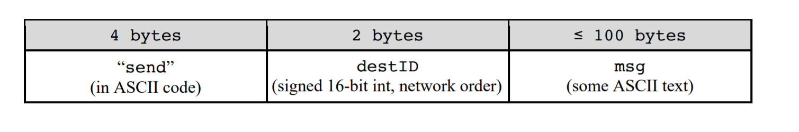
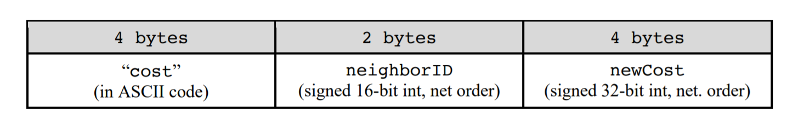

# DisvecRouting
I implemented a traditional shortest-path router 
with distance vector protocols. 

# Environment
### Network Configurations
I tested my program in a single VM. The test networks (i.e., nodes and network
topologies) are constructed by using virtual network interfaces (created by ifconfig) and configuring firewall
rules (configured by iptables).

Note: This program is also fully functional in a single VM.
 
My program act as a node in the constructed network to perform routing tasks. That is, if there are N nodes in the test network, there will be N instances of my programs being started, each
of which runs as one of the nodes with an ID that is associated to an IP address.

The scripts for setting up the network environment are in `supplement` folder.

* The topology's connectivity is defined in a file that gets read by the provided Perl script
(make_topology.pl) to create the network environment. 
* The initial link costs between nodes are defined in files that tell nodes (your programs) what their initial link
costs to other nodes are (if they are in fact neighbors) when the nodes are being run
* For each node, a virtual network interface (eth0:1, eth0:2, etc) will be created and given an IP address
(10.1.1.X).
* A node with ID X gets the IP address 10.1.1.X where 0 ≤ X ≤ 255

# Manager
While running, each nodes will receive instructions and updated information from a manager program.

The manager's packets have two types of instructions: 
1. sending a message data packet 
The format is:

2. updating neighbor link cost. 
The format is:

# Usage

`./vec_router <nodeid> <initialcostsfile> <logfile>`

#### Examples:
`./vec_router 0 costs0.txt test3log0`

* The 1st parameter indicates that this node should use the IP address 10.1.1.<nodeid>.
* The 2nd parameter points to a file containing initial link costs related to this node (see Section 3.2).
* The 3rd parameter points to a file where your program should write the required log messages to.

# Log files
Its importtant to have logs for each router to validate the routing functionality.

When originating, forwarding, or receiving a data packet, the node will log the event to its log file. The sender
of a packet will also log when it learns that the packet was undeliverable. There are four types of log messages that my program is logging:

```
forward packet dest [nodeid] nexthop [nodeid] message [text text]
sending packet dest [nodeid] nexthop [nodeid] message [text text]
receive packet message [text text text]
unreachable dest [nodeid]
```
#### Examples:
```
forward packet dest 56 nexthop 11 message Message1
receive packet message Message2!
sending packet dest 11 nexthop 11 message hello there!
unreachable dest 12
forward packet dest 23 nexthop 11 message Message4
forward packet dest 56 nexthop 11 message Message5
```
In this example, the node forwarded a message bound for node 56, received a message for itself, originated packets for nodes 11 and 12 (but realized it couldn't reach 12), then forwarded another two packets.

# Tie Breaking 
when two equally good paths are available, my node wil choose the one whose next-hop node
ID is lower.

## Miscellaneous
This is a course project for Computer Networks in Univeristy of Illinois at Urbana-Champaign.